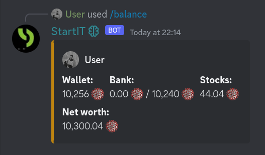

# Basics of currency

In the economy plugin, virtual currency plays a central role. Users can earn currency by performing actions such as
working, chatting, and participating in voice channels. This section will provide an overview of the currency system and
its functionalities.

## /balance Command

The `/balance [user]` command allows you to check your own or someone else's bank account and wallet balance. If a
user's mention or ID is provided as an argument, the command will display the bank account and wallet balance of
that specific user, otherwise it will display the balance of the user who invoked the command.

The currency is stored in two different locations: the wallet and the bank.

## Wallet cash – used for payments, but vulnerable to theft

Wallet is the primary storage for currency and can be used for payments.

The `/rob <user>` command allows you attempting in steal money from another user's wallet. By mentioning or providing
the ID of the target user, you can rob others from cash stored in wallet. However, there is a chance of failure
[**your networth / (their cash + your networth)**] with a minimum and maximum of 20% and 80%. Amount stolen is
calculated as: success probability times their cash.

## Bank storage – protected place to keep funds

Bank provides a secure place to store funds. Money stored in the bank cannot be directly used in commands and must be
withdrawn to the wallet using the /withdraw command.

The `/deposit <amount>` command allows you to deposit a specified amount of money from your wallet into your bank
account. This provides a secure way to store funds and protect them from potential losses through other commands.
You can decide how much money you want to deposit by specifying the desired amount as an argument.

The `/withdraw <amount>` command enables you to withdraw a specified amount of money from your bank account to your
wallet. This allows you to access your funds for various commands and transactions. You can decide how much money you
want to withdraw by specifying the desired amount as an argument.

## /pay – Transferring currency

The `/pay <user> <money>` command allows you to transfer virtual money to another user within the server. By
mentioning or providing the ID of the recipient user and specifying the desired amount, you can initiate a transaction
and send virtual money to someone else.

## /topmoney – Currency leaderboard

The `/topmoney` command lists the top 10 users with the highest amount of virtual money in their bank account.
This command provides an overview of the wealthiest members of the community and can serve as a leaderboard for users to
compare their progress.
