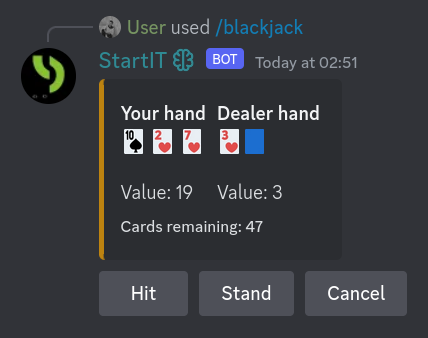

# Blackjack – Hit or stand, luck in your hand

Welcome to the world of Blackjack on StartIT bot! This guide will provide you with an overview of how the Blackjack
game works, both visually and strategically. We will help you understand the mechanics of the game and provide examples
of tactics you can use to improve your chances of winning.

## Game interface

To start a game of Blackjack, use the command `/blackjack <bet>` to place your bet. The bot will then shuffle the card
deck and deal two cards each to the player (you) and the dealer (bot). One of the dealer's cards will be hidden from
you.

During the game, you have several options that you can choose either by clicking the corresponding buttons or by typing
the commands in the chat. The available options are:

- **Stand**: This means you are satisfied with your current hand and don't want any additional cards.
- **Hit**: By choosing this option, you request an additional card from the deck to increase your hand value.
- **Double**: If you believe that a single card will significantly improve your hand, you can double your initial bet
  and receive additional card.
- **Pass**: This option is available when the dealer's face-up card is an Ace ('A'). It allows you to place an insurance
  bet, which will protect you in case the dealer has a Blackjack. If the dealer has a Blackjack, you will receive 50% of
  your initial bet as insurance.
- **Cancel**: If you change your mind or want to exit the game, you can choose this option to cancel your current
  action. Your bet won't be refunded, so rather than canceling, you can simply choose to stand and wait for the round to
  end.

The game continues until either you or the dealer exceeds a total hand value of 21 points. If the dealer's hand exceeds
21 points, you win the round. If both you and the dealer have the same hand value, it's a draw. However, if the dealer's
hand value is closer to 21 than yours, you lose the round.

## Understanding the gameplay

Now let's dive into the mechanics of Blackjack. Each card in the deck has a specific value. Number cards (2-10) are
worth their face value, face cards (Jack, Queen, King) are worth 10 points each, and the Ace can be worth either 1 or 11
points, depending on which value benefits your hand the most.

To calculate the value of your hand, you need to add up the point values of all the cards. For example, if you have a 7
and a Jack, your hand value would be 17 (7 + 10). If you have an Ace and a 5, your hand value would be either
6 (Ace = 1) or 16 (Ace = 11).

The goal of Blackjack is to have a hand value as close to 21 as possible without exceeding it. If you achieve a hand
value of exactly 21 with your initial two cards (an Ace and a card worth 10 points), you have a "Blackjack". A Blackjack
is the strongest hand and results in an automatic win, unless the dealer also has a Blackjack, in which case it's a
draw.

During the game, you can choose to "hit" to receive additional cards or "stand" to keep your current hand. It's
important to consider the total value of your hand and assess the risk of going over 21 points. If your initial hand has
a value between 9 and 11, you may also have the option to "double" your bet and receive one additional card.

## Tactical considerations

Now that you understand the basics, let's explore some tactics that can help improve your chances of winning in
Blackjack:

1. **Learn and Utilize Basic Strategy**: Familiarize yourself with basic Blackjack strategy, which involves making
   optimal decisions based on your hand and the dealer's face-up card. Basic strategy helps maximize your chances of
   winning by following mathematically proven guidelines.

2. **Manage Your Bankroll**: Set a budget for your Blackjack sessions and stick to it. Determine the amount of money
   you're willing to spend and avoid exceeding that limit. This helps ensure responsible gambling and prevents excessive
   losses.

3. **Practice Proper Bet Sizing**: Adjust your bet sizes based on your bankroll. It's generally recommended to wager a
   small percentage of your total bankroll on each hand. This approach helps manage your risk and prevents substantial
   losses in a short period.

4. **Avoid the Insurance Bet**: In our Blackjack, when the dealer's face-up card is an Ace, you will be offered an
   insurance bet (Pass button). However, statistically, insurance bets are not profitable in the long run. It's
   generally recommended to avoid taking insurance bets.

5. **Stay Focused and Avoid Emotional Decisions**: Keep a clear mind while playing our Blackjack. Avoid making
   impulsive decisions based on emotions or past outcomes. Stick to your strategy and make rational choices based on the
   probabilities of the game.

Remember, Blackjack is a game of chance, deck is randomly sorted each game and there are no patterns in our algorithms.
While these tactics can improve your chances of winning, there is no guaranteed strategy for success.
Play responsibly, have fun, and enjoy gaming with our bot!

[//]:  (## TODO Admin: Configuring the Blackjack)
