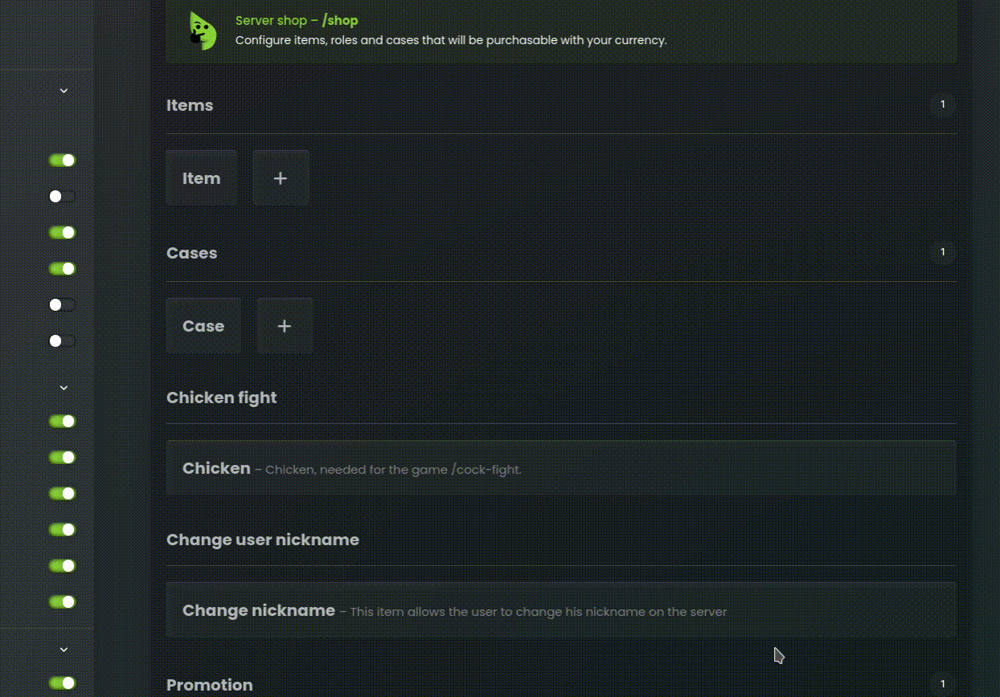
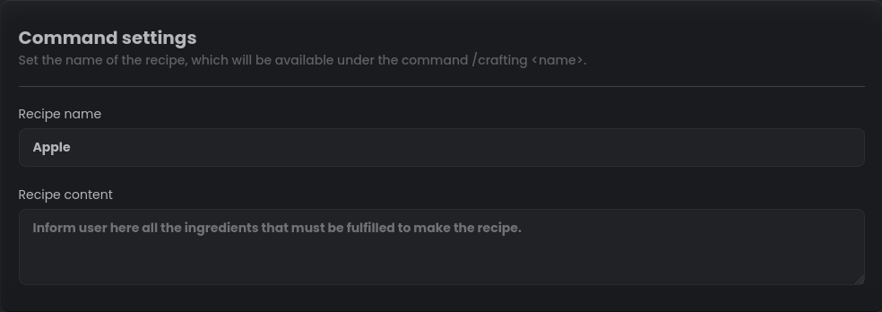
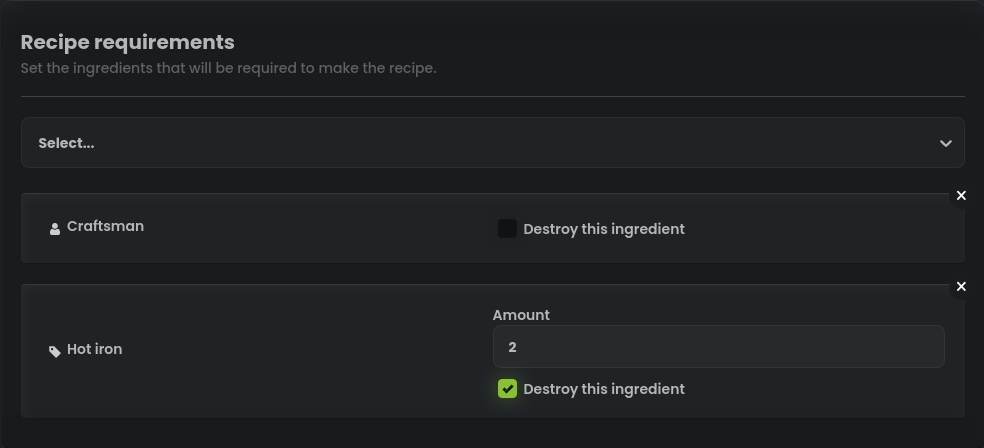

# Configuring crafting recipes

When configuring a crafting recipe, administrators have several options to define its behavior. Let's go through the
available settings step by step:

## Create a new recipe

To create a new recipe, go to the dashboard and scroll to "Crafting recipes" section. Then click the plus button to add
a new recipe.

## Command Settings

### Recipe name

Set the name of the recipe, which will be used in the command for crafting. For example, if you set the recipe name to
"Apple", users will be able to craft the recipe by using the `/craft recipe Apple` command.

### Recipe content

Provide a detailed description of the recipe's requirements. This should include all the ingredients and criteria that
users must meet to craft the recipe successfully. This information will be displayed when users view the recipe through
the `/craft list` command. It is also recommended to include the resulting product in the description.

## Recipe Requirements

In this section, administrators can define the ingredients required for crafting the recipe. The available options are:

- **Money**: Specify the amount of virtual currency required as an ingredient for the recipe.

- **List of roles**: Select specific server roles that users must possess to meet the recipe's requirements.

- **List of items**: Choose the items that users need to have in their possession to fulfill the recipe's requirements.

- **List of cases**: Include specific cases that users must possess in order to proceed with crafting the recipe.

By default, all ingredients selected in this section will be marked with the option "Destroy this ingredient." This
means that the respective roles, money, or cases will be taken away from the user upon successfully crafting the recipe.

## Product

Finally, administrators can specify the product that users will receive upon successfully crafting the recipe. The
product is typically an item, but administrators can get creative and make the recipe give additional rewards such as
money, roles, items, or cases.
