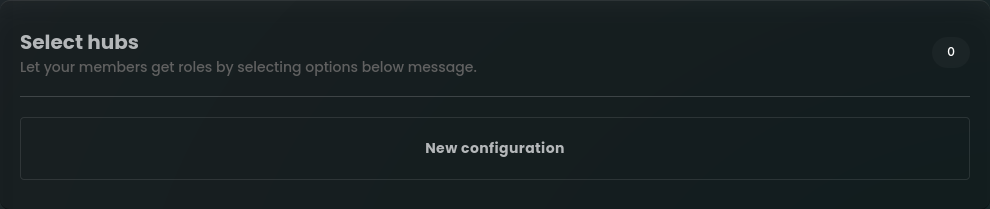
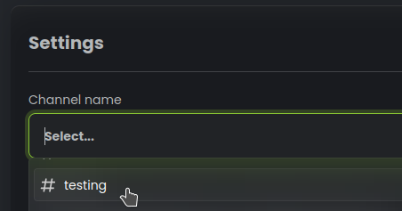
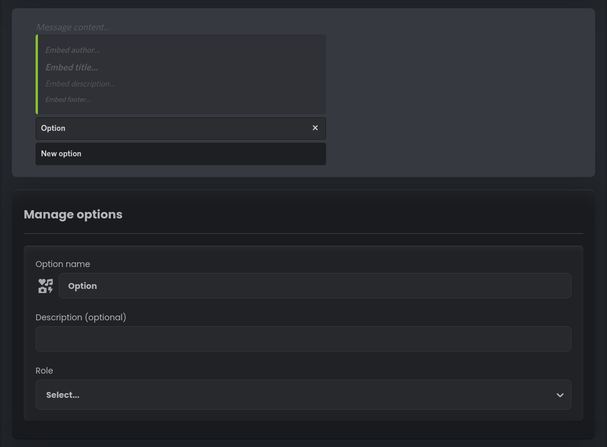
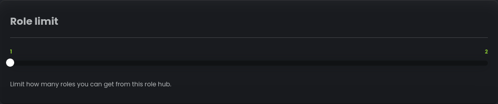
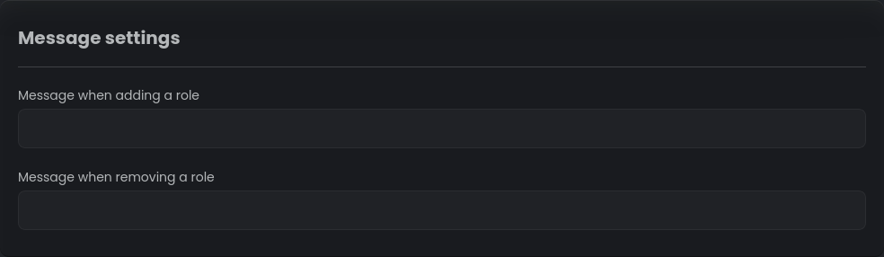

# Panele z wyborem

Witamy w świecie Panele z wyborem, potężnej i wszechstronnej funkcji oferowanej przez naszego bota Discord! Wdrażając
Panele z wyborem, dajesz członkom swojej społeczności możliwość spersonalizowania ich doświadczenia Discord jak nigdy dotąd.
Ta unikalna funkcja przedstawia im wygodne menu wyboru, aby bez wysiłku uzyskać określone role do wyboru.
Sprawdźmy, jak krok po kroku skonfigurować tę wyjątkową funkcjonalność.

## Pierwsze kroki

Aby uzyskać dostęp do funkcji Panele z wyborem, wystarczy przejść do pulpitu nawigacyjnego naszego bota Discord. Gdy już tam będziesz, wybierz
"Selfrole" z lewego paska bocznego. Następnie znajdź zakładkę "Panele z wyborem" i kliknij przycisk
"Nowa konfiguracja".

## Select channel

Select the channel where you want the Button Roles to be active. Members will be able to click buttons and obtain
roles in this specified channel.

## Customize Message

Personalize the message content and embed content to make it more appealing to your members. You can also click on the
green embed bar to change its color.

Click "new option" button to add a new option. You can add as many options as you want. Each option consists of the
following settings:

- **Option Name**: Assign an emoji and a label for the button.
- **Description**: Set a small description displayed below the option name.
- **Role**: Select the role that will be assigned to the member when they click the button.

## Role limit

When you add minimum two options slider "Role limit" will appear. It allows you to set how many roles can user receive
from this select menu.

Once you've tailored all the settings to your liking, remember to save your configurations to ensure they take effect!

---

## Message Settings

Use the **Message when adding a role** input field to set a custom message that will be sent to the member when they
successfully add a role.

Use the **Message when removing a role** input field to set a custom message that will be sent to the member when they
successfully remove a role.

Congratulations! You have now successfully set up the Select Roles feature on your Discord server. Your community
members will love the convenience and personalization this feature offers through the select menu. Enjoy this amazing
functionality, and have a fantastic time engaging with your community and friends!
