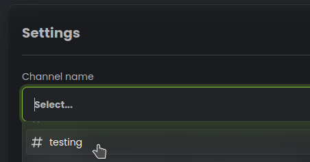

# Panele z przyciskami

Witamy w dokumentacji Paneli z przyciskami, jednej z ekscytujących funkcji naszego bota Discorda! Za pomocą panelu z przyciskami możesz 
pozwolić swoim członkom na otrzymywanie ról poprzez klikanie przycisków pod wiadomościami, ułatwiając im spersonalizowanie ich
doświadczenia na swoim serwerze. Przejdźmy przez proces konfiguracji krok po kroku.

## Pierwsze kroki

Aby uzyskać dostęp do funkcji Panelu z przyciskami, należy przejść do panelu StartIT. Gdy już tam będziesz, wybierz plugin "Selfrole" z lewego paska bocznego. 
Następnie znajdź kartę "Panele z przyciskami" i kliknij przycisk "Nowa konfiguracja".

## Wybór kanału

Wybierz kanał, na którym mają być aktywne panele z przyciskami. Członkowie będą mogli klikać przyciski i uzyskiwać
role w tym określonym kanale.

## Wybór trybu panelu

Wybierz tryb panelu, który odpowiada Twoim potrzebom:
  - **Normalne**: Kliknięcie dodaje role, ponowne kliknięcie usuwa role.
  - **Zabierające**: Kliknięcie zabiera role, ponowne kliknięcie nic nie robi.
  - **Dodające**: Kliknięcie dodaje role, ponowne kliknięcie nic nie robi.

---

## Dostosowywanie wiadomości

Personalizuj treść wiadomości i osadzaj treści, aby były bardziej atrakcyjne dla członków. Możesz także kliknąć zielony pasek osadzania, 
aby zmienić jego kolor.

Kliknij przycisk "nowy przycisk", aby dodać nowy przycisk. Możesz dodać dowolną liczbę przycisków. Każdy przycisk składa się z
następujących ustawień:

  - **Typ przycisku**: Wybierz kolor główny, dodatkowy, sukcesu lub zagrożenia dla przycisku.
  - **Nazwa przycisku**: Przypisz emoji i nazwę dla przycisku.
  - **Rola**: Wybierz rolę, która zostanie przypisana użytkownikowi po kliknięciu przycisku.

Pamiętaj, aby zapisać konfiguracje po zakończeniu dostosowywania wszystkiego!

---

## Ustawienia wiadomości

Użyj pola **Wiadomość przy dodaniu roli**, aby ustawić niestandardową wiadomość, który zostanie wysłany do członka po 
pomyślnym dodaniu roli.

Użyj pola **Wiadomość przy odebraniu roli** aby ustawić niestandardową wiadomość, która zostanie wysłana do członka po
pomyślnyn odebraniu roli.

To wszystko! Funkcja Panele z rolami jest teraz skonfigurowana i gotowa do użycia przez twoją społeczność. Teraz członkowie mogą łatwo 
otrzymywać role klikając przyciski, dzięki czemu jest to zabawny i interaktywny sposób na spersonalizowanie ich doświadczenia na serwerze Discord.
na serwerze Discord. Ciesz się korzystaniem z funkcji Panele z rolami i baw się dobrze rozmawiając i spędzając czas ze swoją społecznością i
przyjaciółmi!
