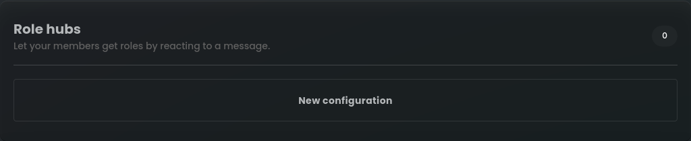
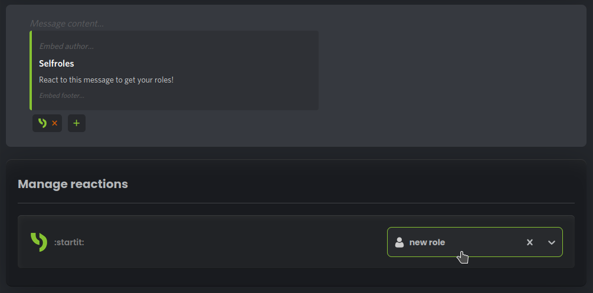
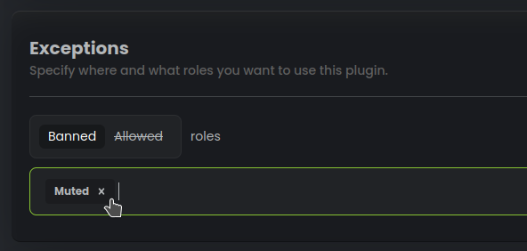
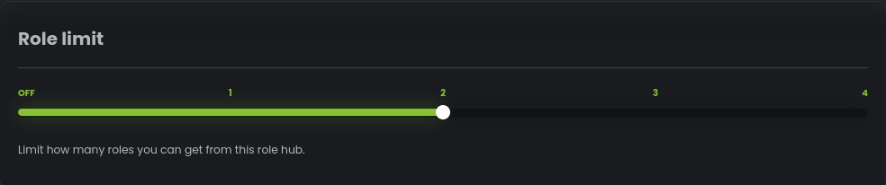

# Panele z rolami

Po wykonaniu poniższych kroków członkowie będą mogli zareagować na wiadomość, aby uzyskać pożądane role 
i cieszyć się bardziej spersonalizowanym doświadczeniem na serwerze Discord.

## Tworzenie nowej konfiguracji

Aby skonfigurować Selfrole dla serwera Discord, przejdź do Panelu StartIT -> Selfrole -> Panele z rolami.

## Wybór kanału

Wybierz kanał, na którym ma zostać umieszczona wiadomość z panelem.

 

## Wybór trybu panelu

Wybierz sposób działania Selfroli w oparciu o swoje preferencje i wymagania serwera:

- **Normalne**: Reagowanie dodaje role, odreagowywanie usuwa role.
- **Zabierające**: Reagowanie zabiera role, odreagowywanie nic nie robi.
- **Dodające**: Reagowanie dodaje role, odreagowywanie nic nie robi.
- **Odwrócone**: Reagowanie zabiera role, odreagowywanie dodaje role.

## Dostosowywanie wiadomości

Spersonalizuj treść wiadomości i osadzoną zawartość, aby była bardziej atrakcyjna dla członków.
Możesz także kliknąć zielony pasek osadzania, aby zmienić jego kolor.

Dodaj reakcje do wiadomości, aby reprezentować różne role, które członkowie mogą wybrać.

Następnie w sekcji "Zarządzanie reakcjami" przypisz reakcje do określonych ról, aby członkowie otrzymywali odpowiednie role 
po zareagowaniu na wiadomość.

## Ustaw wyjątki (opcjonalnie)

Ustawiając wyjątki dla określonych ról, można ograniczyć osoby, które mogą lub nie mogą przypisywać sobie ról w tym panelu z rolami.

## Limit ról

Ustaw, ile ról może otrzymać użytkownik jednocześnie. 

W tym przykładzie ograniczamy, że pojedynczy użytkownik może uzyskać tylko 2 role z tego panelu. [Funkcja ta jest dostępna tylko w "normalnym" trybie panelu]
