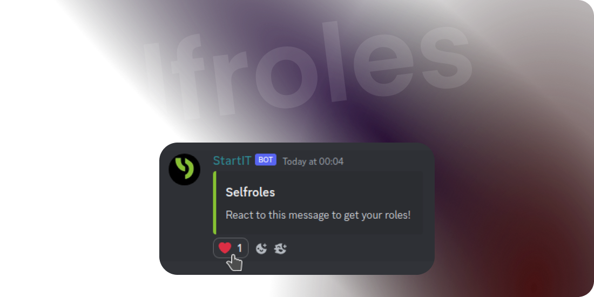

# Selfrole



**Selfrole** to ekscytująca funkcja StartIT, która pozwala członkom serwera przypisywać i zarządzać swoimi rolami poprzez
reagując na określone wiadomości. Za pomocą Selfroli możesz usprawnić proces przypisywania ról i umożliwić członkom społeczności
członków społeczności do spersonalizowania ich doświadczenia Discord. Ta dokumentacja poprowadzi Cię przez konfigurację i
konfigurowanie Selfroli, abyś mógł w pełni wykorzystać tę potężną funkcję.

## Dlaczego potrzebujesz Selfrole?

Selfrole oferują kilka korzyści dla społeczności Discord:


```cards
# Personalizacja
Członkowie mogą personalizować swoje profile, wybierając role, które reprezentują ich zainteresowania, umiejętności lub powiązania.

# Uprawnienia użytkowników
Daj swoim członkom możliwość autonomicznego wyboru ról, zmniejszając potrzebę ręcznego przypisywania ról przez administratorów.

# Zaangażowanie społeczności
Pozwalając członkom na interakcję z wiadomościami dotyczącymi przypisywania ról, tworzysz angażujące i interaktywne środowisko.

# Elastyczność
Samodzielne role dobrze sprawdzają się w społecznościach hobbystycznych, serwarach graczy lub na każdym serwerze, na którym użytkownicy mają różne zainteresowania i role.
```
